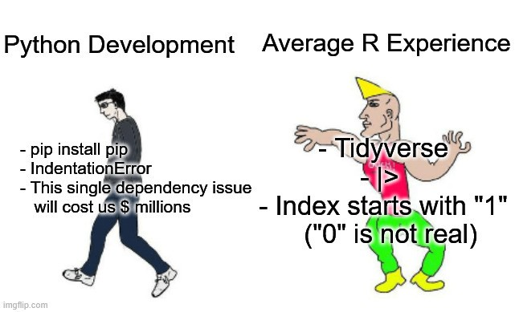
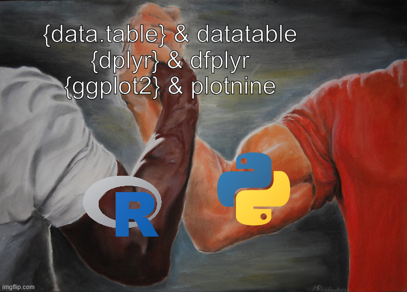

# Hallo!

::: columns
::: {.column width="50%"}
 </img>
:::

::: {.column width="50%"}
<br> <br>

<ul style="list-style:none;">

<li>{style="width:32px;                                             height:32px;                                             position:relative;                                             top:15px;"}[lkds.lol](https://lkds.lol)</li>

<li>{style="width:32px;                                             height:32px;                                             position:relative;                                             top:15px;"} [LinusLach](github.com/linuslach)</li>

<li>{style="width:32px;                                             height:32px;                                             position:relative;                                             top:15px;"} [linus-konstanzer](https://www.linkedin.com/in/linus-konstanzer)</li>

</ul>
:::
:::

## Zeitplan (Uhrzeiten Flexibel!)

- 02.10.26: 8:30-11:30 12:15-15:?
- 17.10.26: 8:30-11:30 12:15-15:?
- 13.11.26 & 14.11.26 oder 20.11.26 & 21.11.26: 8:30-11:30 12:15-15:?

Format Abschlussprüfung: Unklar!

## R for Data Science and Machine Learning?

<br>

> Warum verwenden wir nicht einfach Python?

::: columns
::: {.column width="50%"}
::: {.fragment index="1"}

:::
:::

::: {.column width="50%"}
::: {.fragment index="1"}

:::
:::
:::

## Agenda (Allgemein)

:::{.incremental}

1. Installation von R und RStudio
2. Grundlagen in R und Umgang mit Daten
3. Lineare Regression
4. Baum Modelle
5. Klassifikation
   
:::

## Ziel dieser Veranstaltung
:::{.incremental}

1.    Erlerne den Umgang mit R **grundlegend**:
      - Einlesen von Daten
      - Explorieren und Analysieren von Daten (EDA)
      - Trainieren von statistischen Modellen
2.    Umgang mit Regressionsaufgaben:
      - Vorhersagen einer stetigen Zielvariable wie Zimmerpreis, Kaltmiete, Gewicht von Pinguinen!
      - Von einfacher linearer Regression bis hin zu Random Forests
3.    Umgang mit Klassifikationsaufgaben:
      - Zuordnung von diskreten, binären Zielvariablen wie Positiver Test auf Krankheit oder Geschlechter von Pinguinen!
      - Von logistischer Regression bis Klassifikationsbäume

:::

## Resources for this Tutorial

Skript

```{r}
#| eval: false
https://lkds.lol/SP/Statistische-Programmierung.pdf
```


<br>

Lösungen:

```{r}
#| eval: false
TBD!
```

## Weiterführendes Material

:::{.incremental}

- [Tidy Modelling with R](https://www.tmwr.org/) by Max Kuhn and Julia Silge

- [R for Data Science (R4DS)](https://r4ds.hadley.nz/) by Hadley Wickham, Mine Çetinkaya-Rundel, and Garrett Grolemund.

- [Statistical Inference via Data Science: A Modern Dive into R and the Tidyverse](https://moderndive.com/) by Chester Ismay and Albert Y. Kim.

- [Data Science Box](https://datasciencebox.org/) by Mine Çetinkaya-Rundel

:::

